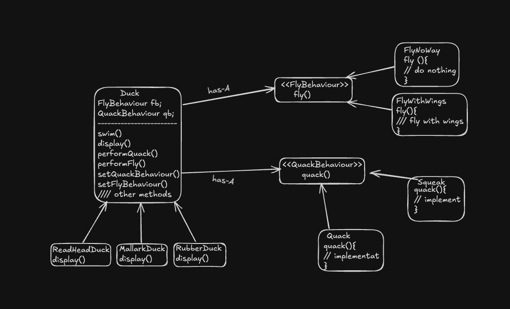
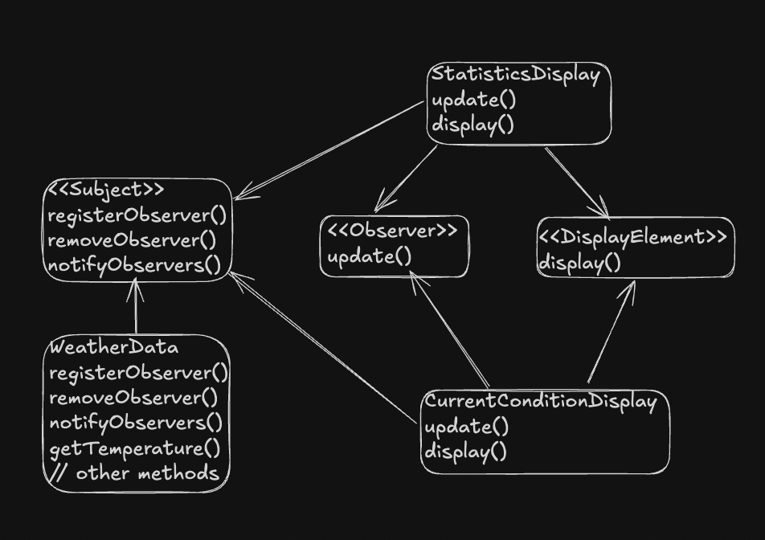

# Design Patterns Implementation

### 1.Strategy Pattern
Defines a family of algorithms,encapsulate each one and make them interchangeable.Strategy let the algorithm vary independently from the client that uses it.

###  The Observer Pattern
It defines a one-to-many dependency between objects so that when one object changes state, 
all of its dependents are notified and updated automatically.
Strive for loosely coupled designed between the object that interacts

### Decorator Pattern
The Decorator Pattern attaches additional responsibilities to an object dynamically.
Decorators provide a flexible alternative to subclassing for extending functionality.
It wraps the object for adding more behaviour. The decorator adds its own behavior either 
before and/or after delegating it to object they decorate.Decorators have the same supertype as the objects they decorate


### Factory Pattern
Factory Pattern encapsulate object creation by letting the subclasses decide what object to create. 
Factor Method let the class defer the instantiation to subclasses

### Abstract Factory Pattern
It provides an interface for creating families of related or
dependent objects without specifying their concrete classes.

### The Command Pattern
It encapsulates a request as an object, thereby letting you parameterize other objects with different requests, 
queue or log requests, and support undoable operations.When u need to decouple the object making the request
from the object that know how to perform the requested action

***Meta Command Pattern***
allows you to create macros of commands so that you can execute multiple commands at once.
Macro Commands are a simple extension of Command that allow multiple commands to be invoked

### Adapter Pattern

The Adapter Pattern converts the interface of a class into another interface the clients expect. It is class that converts
one interface to another that client understands. We can handle this by changing either client code or vendor code
but that tightly couples client and vendor which in this case are not.
Adapter lets classes work together that couldn’t otherwise because of incompatible interfaces.

### Template Method Pattern 
It defines the skeleton of an algorithm in a method, deferring some steps to subclasses. 
Template Method lets subclasses redefine certain steps of an algorithm without changing the 
algorithm’s structure.
***
### Dependency Inversion Principal (DI)
It says depend on abstractions. Do not depend on concrete classes.
High level component should not depend on low level components. They should depend on abstraction.

***Guidelines to follow DI***
1. No variable should hold reference to concrete class. If you use **new** you will be holding reference to concrete class. Use factory to get around that.
2. No class should derive from concrete class. Derive from abstraction like Interface or abstract class.


# Kafka Streams Challenges

This repository contains a set of challenges focused on Kafka Streams. These challenges are designed to test and enhance your understanding of stream processing with Kafka.

For each challenge:
- Think about the design of the Kafka Streams topology.
- Consider potential joins or windowed operations.
- Think about edge cases and how you'd handle them.
- Consider how you might scale the solution for a large number of records.

## Challenges

### 1. Page View Counter

**Scenario**:
You're receiving a stream of page view events from a website. Each event contains a `userId` and a `pageId`. You're tasked with counting the number of views per page in real-time.

- **Input Topic**: `page-views`
    - Sample record: `{ userId: "user123", pageId: "page56" }`
- **Output**: A `KTable` or a topic that shows the count of views for each page.

### 2. Inventory Management

**Scenario**:
An e-commerce platform streams inventory updates (additions and removals) for products. Calculate the current stock for each product.

- **Input Topic**: `inventory-updates`
    - Sample record: `{ productId: "product123", change: 5 }`
- **Output**: A `KTable` or a topic that reflects the current stock for each product.

### 3. Session Duration Calculation

**Scenario**:
You're getting a stream of user activity events with timestamps. Each user activity marks the beginning or end of a user's session. Calculate the duration of each user's session.

- **Input Topic**: `user-activity`
    - Sample records: `{ userId: "user456", timestamp: 1630792800, type: "start" }` and `{ userId: "user456", timestamp: 1630796400, type: "end" }`
- **Output**: A topic that emits the session duration for each user.

### 4. Failed Transaction Alerts

**Scenario**:
A stream of transactions includes success and failure events. If a user has more than 3 failed transactions within a 5-minute window, generate an alert.

- **Input Topic**: `transactions`
    - Sample record: `{ userId: "user789", status: "failed", timestamp: 1630792800 }`
- **Output**: A topic that emits alerts for users with more than 3 failed transactions within a 5-minute window.

### 5. Product Recommendations

**Scenario**:
Users view products and buy products. For each product viewed, recommend the top 3 products that other users viewed and then purchased.

- **Input Topics**: `product-views` and `product-purchases`
    - Sample record: `{ userId: "user012", productId: "product345" }`
- **Output**: A topic that emits a product and its top 3 recommended products.


# Real-time Fraud Detection with Dynamic Thresholds

## Background
A bank processes millions of transaction events per day. For security purposes, the bank wants to detect potential fraud in real-time. Instead of using a static threshold (e.g., alert if more than 5 transactions occur within 10 minutes), the bank wishes to use a dynamic threshold based on the last 30 days of activity for each account.

## Scenario
For each account, calculate the average number of transactions over the last 30 days in hourly rolling windows. If the number of transactions in the current hour exceeds this average by a factor of 2 (or any other factor the bank chooses), generate an alert.

### Input Topic: `transactions`
```json
{
   "accountId": "account1234",
   "transactionId": "txn5678",
   "amount": 100.25,
   "timestamp": 1632817200
}
```

## Output
- A Kafka topic that emits alerts for accounts that exceed the dynamic threshold.

## Key Challenges
1. **Rolling Window Calculation:** Use tumbling windows to calculate hourly statistics for the past 30 days.
2. **Running Averages:** Keep a running average of transactions for each account.
3. **Real-time Anomaly Detection:** Compare real-time transaction counts to the average to detect anomalies.
4. **Late-arriving Data:** Handle late-arriving data or out-of-order events, which can affect the correctness of the average and the resulting alerts.
5. **State Management:** Efficient state management, given that you're maintaining a significant history for each account.
6. **Scalability:** Ensure that the solution scales for millions of accounts and transactions.

## Hints
- **Kafka Streams:** Leverage Kafka Streams' windowing capabilities to build hourly windows.
- **State Stores:** Use state stores to keep a running average.
- **Processor API:** Consider using the Processor API for finer control over state management, especially if you need to manage late-arriving data.
- **Memory Management:** Be mindful of memory and state store sizes. You might need to adjust the configurations accordingly.
- **Out-of-order Events:** For out-of-order events, consider using punctuation to periodically "close" windows and adjust averages based on late data.


